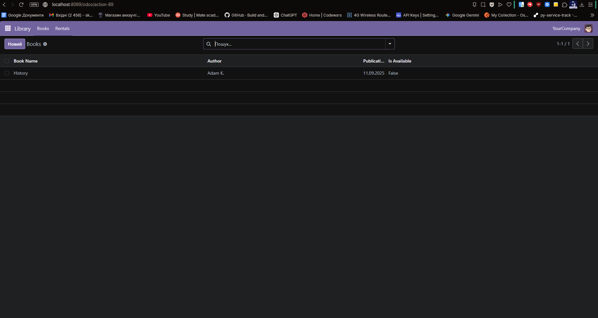
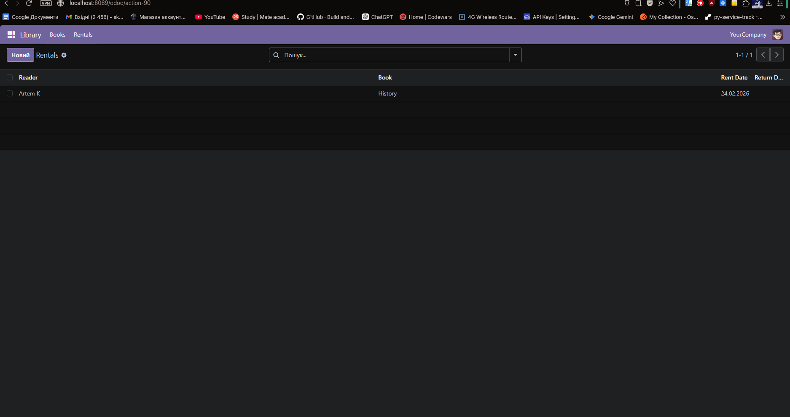
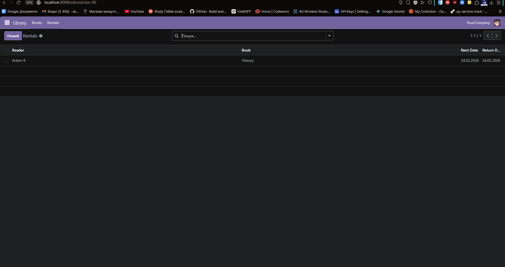
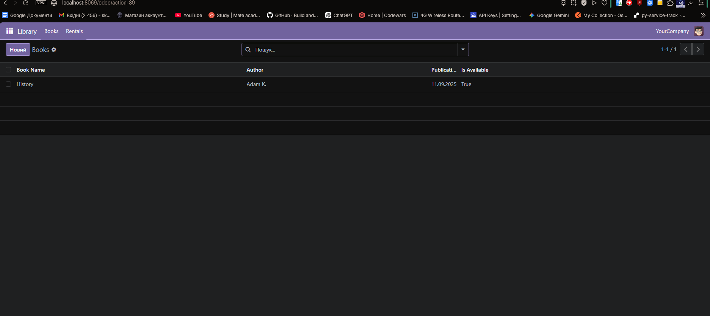
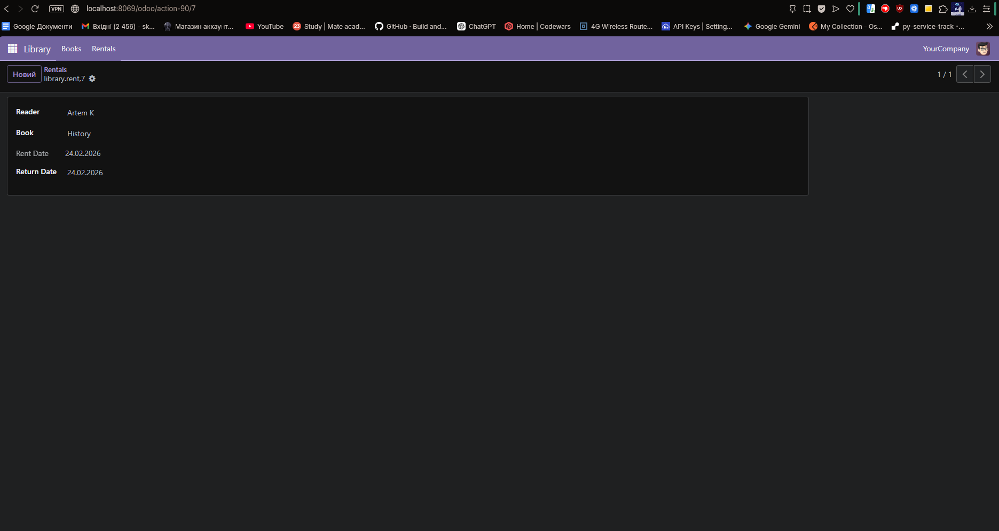

# Library Management — Odoo 18 Module

A custom Odoo 18 module for managing a library: books, authors, availability, and rental transactions.

## Requirements

- [Docker](https://docs.docker.com/get-docker/)
- [Docker Compose](https://docs.docker.com/compose/install/) (v2+)

---

## Running the application

### 1. Clone the repository

```bash
git clone <repository-url>
cd odoo-test
```

### 2. Start the containers

```bash
docker compose up --build
```

This starts two services:
- **web** — Odoo 18 on port `8069`
- **db** — PostgreSQL 15

The first build downloads the Odoo `.deb` package and may take a few minutes.

### 3. Open Odoo in the browser

```
http://localhost:8069
```

### 4. Create the database

On first run you will see the database creation page. Fill in:

| Field | Value |
|-------|-------|
| Master Password | `admin` (default) |
| Database Name | `test_odoo` |
| Email | your email |
| Password | your password |

Click **Create database** and wait for initialisation to finish.

### 5. Activate Developer Mode

1. Go to **Settings → General Settings**
2. Scroll to the bottom and click **Activate the developer mode**

Or navigate directly to:
```
http://localhost:8069/web?debug=1
```

### 6. Install the Library Management module

1. Go to **Apps**
2. Click **Update Apps List** (requires Developer Mode)
3. Search for `Library Management`
4. Click **Install**

---

## Using the module

After installation a **Library** menu appears in the top navigation bar.

| Menu | Description |
|------|-------------|
| Library → Books | Add/edit books; issue a book via the **Publish book** button |
| Library → Rentals | View all rental records; fill in **Return Date** when a book is returned |

### Issuing a book

1. Open a book record (**Library → Books → [book name]**)
2. Click the **Publish book** button in the header (visible only when the book is available)
3. Select a reader in the dialog and click **Confirm**
4. The book's **Is Available** field switches to `False` automatically

### Returning a book

Open the rental record (**Library → Rentals**) and set the **Return Date** field.
To make the book available again, re-open the book record and set **Is Available** back to `True`.

---

## REST API

Returns all books and their availability status. No authentication required.

```bash
GET http://localhost:8069/library/books
```

Example response:

```json
[
  {
    "id": 1,
    "name": "Clean Code",
    "author": "Robert C. Martin",
    "published_date": "2008-08-01",
    "is_available": false
  }
]
```

---

## Stopping the application

```bash
docker compose down
```

To also remove all stored data (database, filestore):

```bash
docker compose down -v
```

## Screenshots






